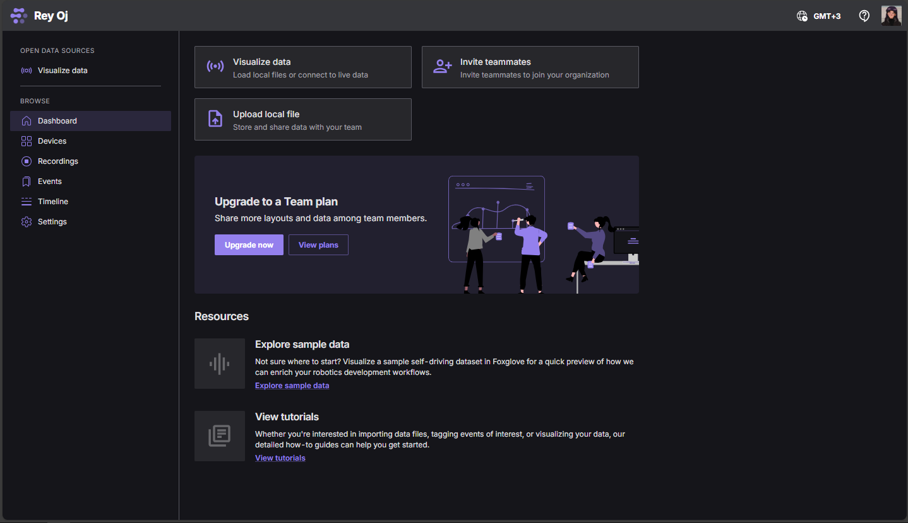
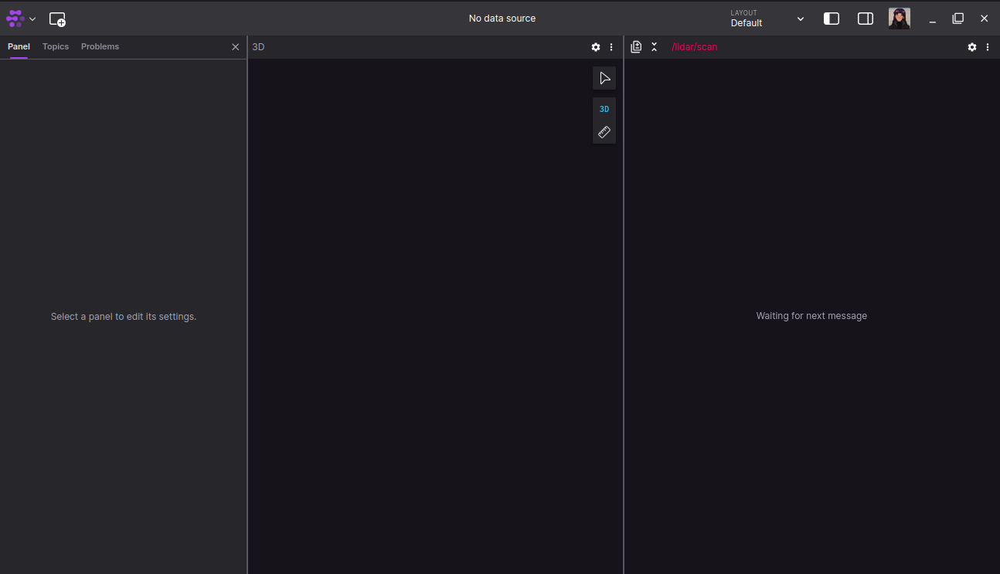
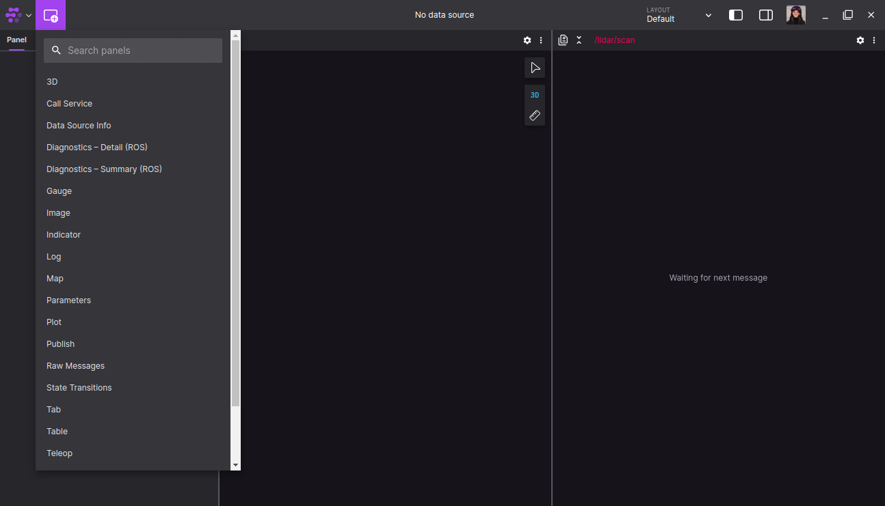
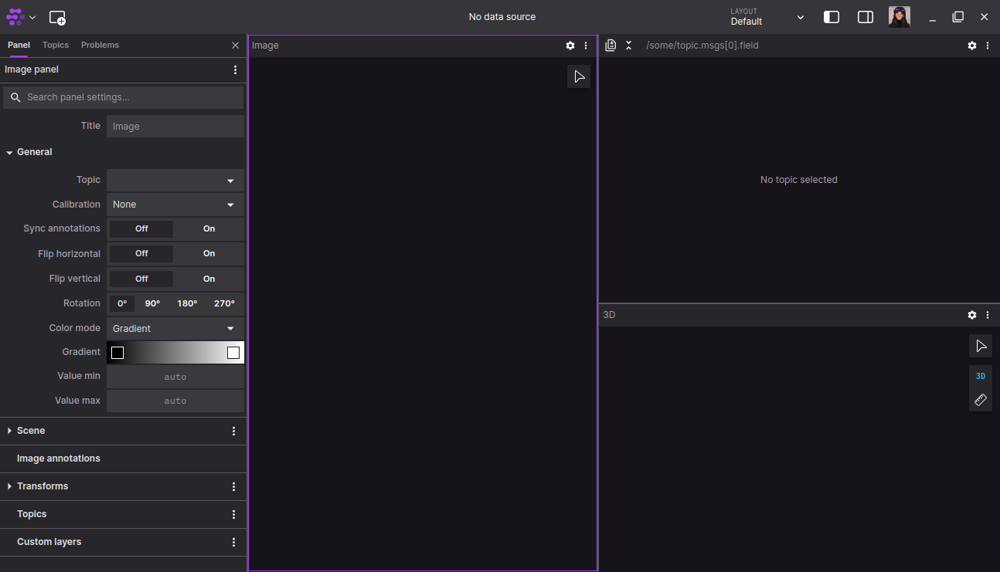
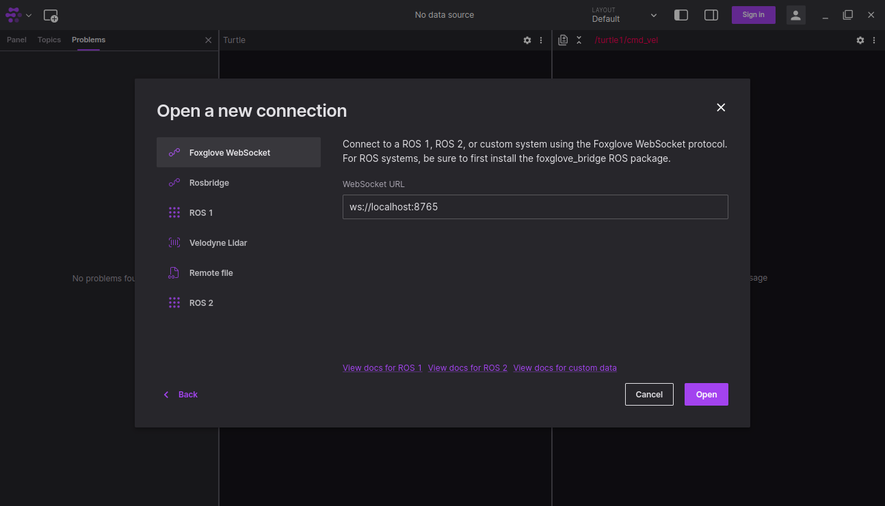
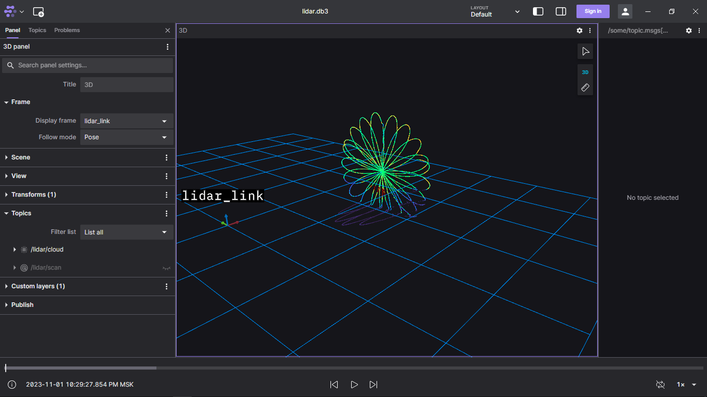

# Установка и работа с Foxglove на Ubuntu 20.04
## Что такое Foxglove?
Foxglove - средство визуализации получаемых данных в ROS, которое также позволяет передавать в topic какие-либо сообщения.
## Установка на Ubuntu
Открываем терминал и прописываем
```
sudo snap install foxglove-studio
```
После этого этапа программа должная появиться в списке приложений, установленных на компьютере, но также можно её запустить и через консоль:
```
foxglove-studio
```
На этом этап установки завершён.
## Установка на Windows
Да, Foxglove также можно установить на Windows и с тем же успехом открывать ROSbag файлы и подключаться к ROS. 
Для этого необхождимо перейти на сайт https://foxglove.dev/download и нажать кнопку Download.
## Использование веб версии Foxglove Studio 
Это веб версия самой программы, которая позволяет делать всё то же самое, что и предыдущие две.
Для её использования необходимо перейти на сайт https://foxglove.dev/studio и нажать на кнопку "Get started for free". После прохождения регистрации нас встретит такое окно, которое не сильно отличается от окна установленной программы

## Начало работы
При первом запуске нас встречает такое окно:

Foxglove позволяет просматривать полученные данные в различных форматах. Для этого необходимо нажать на кнопку, расположенную чуть правее логотипа Foxglove в левом верхнем углу

Здесь можно увидеть немалое количество окон для получения данных: от обычных постов в topic до отображения местоположения на карте.  
К примеру откроем новое окно с отображением изображений

## Подключение к ROS
### Подключаемя по сети
Для начала необходимо установить Foxglove bridge, который и позволит ROS подключаться к Foxglove. Для этого вводим в терминал команду
```
sudo apt install ros-galactic-foxglove-bridge
```
После этого для запуска вводим в терминал
```
ros2 run foxglove_bridge foxglove_bridge
```
Итак, наш сервер запущен. Чтобы к нему подключиться нажмём в левом верхнем углу логотип Foxglove. Выбираем File и нажимаем "Open connection". Нас встречает такое окно

Выбираем "Foxglove websocket" и ничего не меняя нажимаем "Open". Таким образом мы подключились к ROS2 и теперь можем как просматривать топики, так и отправлять в них что-либо.
### Открытие ROSbag файла
Как и в предыдущем варианте нажимаем на логотип Foxglove, выбираем File, но выбираем пункт "Open local file". Находим в проводнике необходимый нам .db3 файл и открываем его. В итоге окно должно выглядеть как-то так, но всё зависит от информации, содержащейся в файле

Снизу расположен таймлайн, с помощью которого можно просматривать определённые промежутки записи