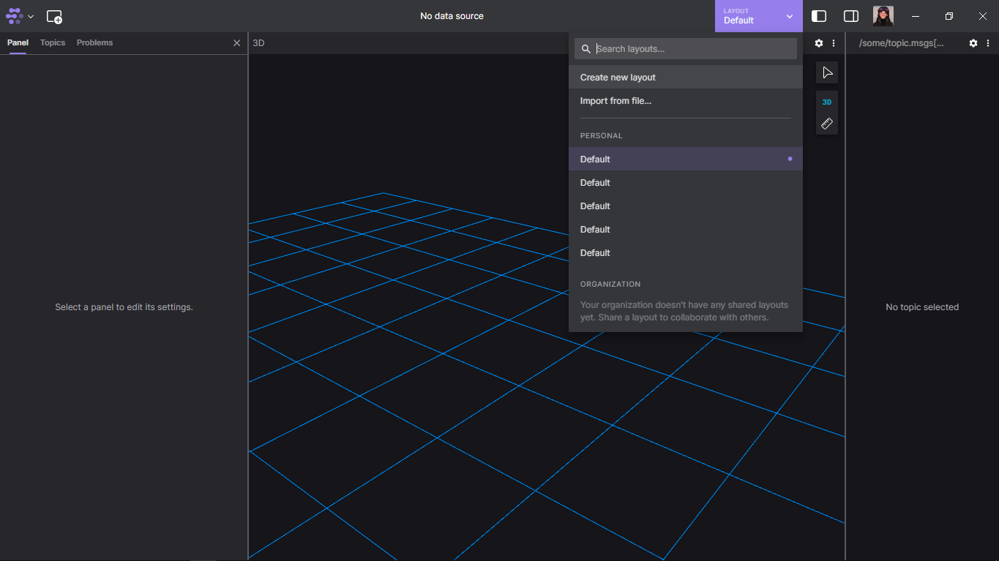
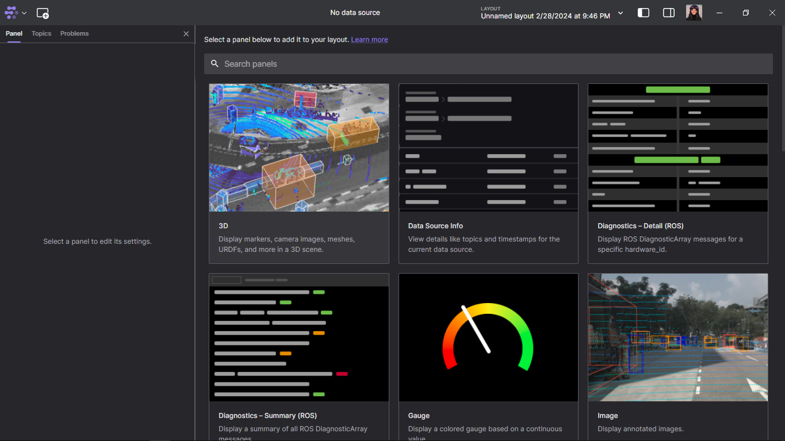
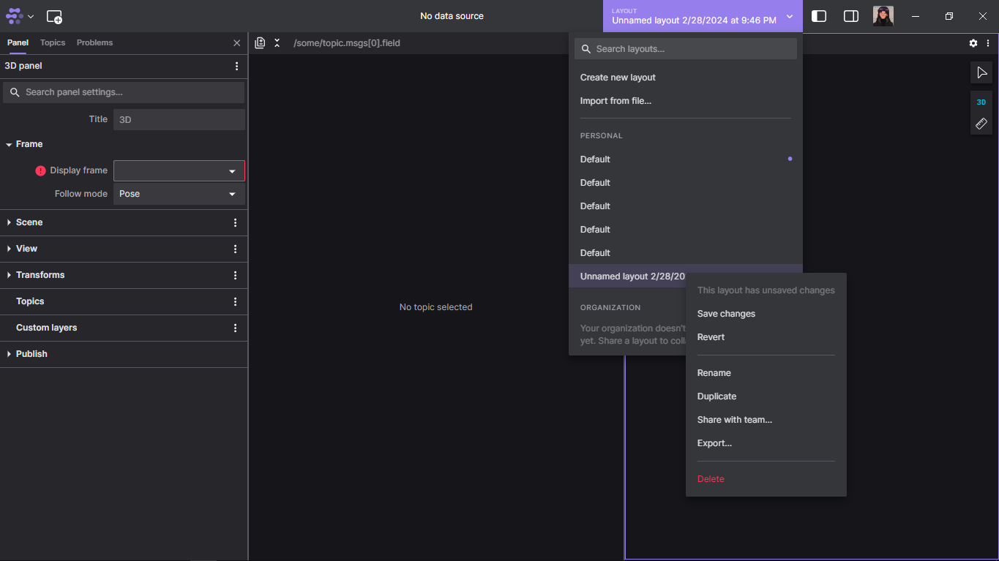

# Установка и работа с Foxglove на Ubuntu 20.04
## Что такое Foxglove?
Foxglove - средство визуализации получаемых данных в ROS, которое также позволяет передавать в topic какие-либо сообщения.
## Возможности
Кратко о возможностях программы
* визуализация данных рахличных форматов
* возможность просматривать топики
* возможность отправлять сообщения в топики
* также имееются окна, которые позволяют настроить отправку сообщений при нажатии на кнопки (к примеру окно Teleop)
## Установка на Ubuntu
Открываем терминал и прописываем
```
sudo snap install foxglove-studio
```
После этого этапа программа должная появиться в списке приложений, установленных на компьютере, но также можно её запустить и через консоль:
```
foxglove-studio
```
На этом этап установки завершён.
## Установка на Windows
Да, Foxglove также можно установить на Windows и с тем же успехом открывать ROSbag файлы и подключаться к ROS. 
Для этого необхождимо перейти на сайт https://foxglove.dev/download и нажать кнопку Download.
## Использование веб версии Foxglove Studio 
Это веб версия самой программы, которая позволяет делать всё то же самое, что и предыдущие две.
Для её использования необходимо перейти на сайт https://foxglove.dev/studio и нажать на кнопку "Get started for free". После прохождения регистрации нас встретит такое окно, которое не сильно отличается от окна установленной программы

## Регистрация
Для создания аккаунта понадобится Email, либо аккаунт Google или Microsoft. Последние два варианта являются самыми удобными, так как не требуют получения писем на почту.
При входе в аккаунт в самом приложении откроется окно браузера, где будет либо форма входа (если не произведена авторизация в аккаунте в самом браузере), либо произойдёт автоматический вход в аккаунт, через который вы авторизовались в браузере.
Также хочу заметить, что установленным приложением можно пользоваться и без регистации, то есть для использования вход в аккаунт необязателен.
## Начало работы
При первом запуске нас встречает такое окно:

Foxglove позволяет просматривать полученные данные в различных форматах. Для этого необходимо нажать на кнопку, расположенную чуть правее логотипа Foxglove в левом верхнем углу

Здесь можно увидеть немалое количество окон для получения данных: от обычных постов в topic до отображения местоположения на карте.  
К примеру откроем новое окно с отображением изображений

## Подключение к ROS
### Подключаемя по сети
Для начала необходимо установить Foxglove bridge, который и позволит ROS подключаться к Foxglove. Для этого вводим в терминал команду
```
sudo apt install ros-galactic-foxglove-bridge
```
После этого для запуска вводим в терминал
```
ros2 run foxglove_bridge foxglove_bridge
```
Итак, наш сервер запущен. Чтобы к нему подключиться необходимо находиться в одной локальной сети с устройством с ROS, либо открыть порты для возможности подключения через глобальную сеть. Нажмём в левом верхнем углу логотип Foxglove. Выбираем File и нажимаем "Open connection". Нас встречает такое окно

Выбираем "Foxglove websocket" и ничего не меняя нажимаем "Open" (если ROS запущен на том же устройстве, где и Foxglove), либо вписываем адрес устройства с ROS так же нажимаем на кнопку "Open". Таким образом мы подключились к ROS2 и теперь можем как просматривать топики, так и отправлять в них что-либо.
### Открытие ROSbag файла
Как и в предыдущем варианте нажимаем на логотип Foxglove, выбираем File, но выбираем пункт "Open local file". Находим в проводнике необходимый нам .db3 файл и открываем его. В итоге окно должно выглядеть как-то так, но всё зависит от информации, содержащейся в файле

Снизу расположен таймлайн, с помощью которого можно просматривать определённые промежутки записи.
## Сохранение и открытие конфигурации рабочего окна
Всё достаточно просто: надо кликнуть по кнопке "Layout" в правой верхней части окна и нажать "Create new layout"

Конфигурация создана! В новом открывшемся окне нам необходимо выбрать первый элемент, который будет находиться в окне

После этого окно станет привычным, и добавлять новые элементы можно будет знакомым нам уже способом.
После настройки необходимо сохранить изменения. Для этого кликнем по той же кнопке "Layout", выберем наше недавно созданное окно и кликнем по нему правой кнопкой мыши. В появившемя меню необходимо нажать "Save changes"

Также здесь можно дать название конфигурации, нажав кнопку "Rename".
Тут же можно экспортировать конфигурацию в виде json файла, для возможности использовать её и на других устройствах. Для этого необходимо нажать кнопку "Export" и в открывшемся окне проводника дать название конфигурации. После этого её можно будет открыть с помощью кнопки "Import from file", выпадающей после нажатия кнопки "Layout".
В качестве примера в репозитории находится [файл](example.json), который можно открыть и понять работу сохранения концигурации рабочего окна.